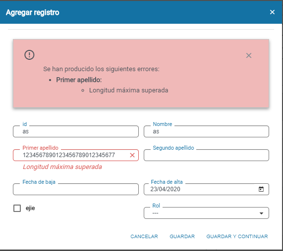

# Componentes RUP – Feedback

<!-- MDTOC maxdepth:6 firsth1:1 numbering:0 flatten:0 bullets:1 updateOnSave:1 -->

   - [1   Introducción](#1-introducción)   
   - [2   Ejemplo](#2-ejemplo)   
   - [3   Casos de uso](#3-casos-de-uso)   
   - [4   Infraestructura](#4-infraestructura)   
      - [4.1 Ficheros](#4.1-ficheros)   
      - [4.2 Dependencias](#4.2-dependencias)   
      - [4.3 Versión minimizada](#4.3-versión-minimizada)   
   - [5   Invocación](#5-invocación)   
   - [6    API](#6-api)   
   - [7   Sobreescritura del theme](#7-sobreescritura-del-theme)   

<!-- /MDTOC -->

##  1	Introducción
La descripción del Componente Feedback visto desde el punto de vista de **RUP** es la siguiente:
*Se informa al usuario de cómo interactuar con los elementos de la aplicación y del resultado de cualquier acción que realice o cualquier problema que tenga y de cómo solucionarlo.*

##  2	Ejemplo
Se presentan a continuación un ejemplo del componente:


##  3	Casos de uso
Se recomienda el uso del componente:
+	Cuando el usuario tenga una necesidad de información ya sea por cambios en el sistema, ejecución de procesos, realización de tareas o confirmación de acciones.

En concreto, los principales tipos de feedback que tenemos que considerar son los siguientes:
+	Mensajes de sistema o informativos
+	Mensajes de confirmación
+	Mensajes de error y aviso
+	Feedback de formularios y edición
+	Estado de un proceso
+	Mensajes previos / previsualización

##  4	Infraestructura
A continuación se comenta la infraestructura necesaria para el correcto funcionamiento del componente.
+	Únicamente se requiere la inclusión de los ficheros que implementan el componente *(js y css)* comentados en los apartados Ficheros y Dependencias.

### 4.1	Ficheros
Ruta Javascript: rup/scripts/
Fichero de plugin: **rup.feedback-x.y.z.js**
Ruta theme: rup/css/
Fichero css del theme: **theme.rup.feedback-x.y.z.css**

### 4.2	Dependencias
Por la naturaleza de desarrollo de los componentes (patrones) como plugins basados en la librería JavaScript ***jQuery***, es necesaria la inclusión del esta. La versión elegida para el desarrollo ha sido la versión **3.4.1**.
+	**jQuery 3.4.1**: http://jquery.com/

La gestión de la ciertas partes visuales de los componentes, se han realizado medieante el plugin ***jQuery UI*** que se basa en *jQuery* y se utiliza para construir aplicaciones web altamente interactivas. Este plugin, proporciona abstracciones de bajo nivel de interacción y animación, efectos avanzados de alto nivel, componentes personalizables (estilos) ente otros. La versión utilizada en el desarrollo ha sido la **1.12.0**.
+	**jQuery UI 1.12.0**: http://jqueryui.com/

Los ficheros necesarios para el correcto funcionamiento del componente son:

    jquery-3.4.1.js
    rup.base-x.y.z.js
    rup.feedback-x.y.z.js
    theme.rup.feedback-x.y.z.css

### 4.3	Versión minimizada
A partir de la versión v2.4.0 se distribuye la versión minimizada de los componentes RUP. Estos ficheros contienen la versión compactada y minimizada de los ficheros javascript y de estilos necesarios para el uso de todos los compontente RUP.
Los ficheros minimizados de RUP son los siguientes:
+	**rup/scripts/min/rup.min-x.y.z.js**
+	**rup/css/rup.min-x.y.z.css**

Estos ficheros son los que deben utilizarse por las aplicaciones. Las versiones individuales de cada uno de los componentes solo deberán de emplearse en tareas de desarrollo o depuración.

##  5	Invocación
Este componente se aplica sobre una capa definida que tendrá como objeto el mostrar los mensajes al usuario. Será labor del desarrollador definir dicha capa en su página y definir un identificador que se utilizará en la invocación del componente.
```javascript
$("#id_capa").rup_feedback(properties);
```
Donde el parámetro *“properties”* es un objeto *(var properties = {})* o bien directamente la declaración de lo valores directamente. Sus posibles valores se detallan en el siguiente apartado.

## 6	API

Para ver en detalle la API del componente vaya al siguiente [documento](../api/rup.feedback.md).

##  7	Sobreescritura del theme
El componente feedback se presenta con una apariencia visual definida en el fichero de estilos **theme.rup.feedback-x.y.z.css**.

Si se quiere modificar la apariencia del componente, se recomienda redefinir el/los estilos necesarios en un fichero de estilos propio de la aplicación situado dentro del proyecto de estáticos *(codAppStatics/WebContent/codApp/styles)*.

Los estilos del componente se basan en los estilos básicos de los widgets de *jQuery UI*, con lo que los cambios que se realicen sobre su fichero de estilos manualmente o mediante el uso de la herramienta [Theme Roller](http://jqueryui.com/themeroller/) podrán tener repercusión sobre todos los componentes que compartan esos mismos estilos (pudiendo ser el nivel de repercusión general o ajustado a un subconjunto de componentes).

A continuación se muestran unas capturas del componente con los estilos asociados dependiendo del uso de imágenes. Los estilos que contengan la palabra *“ui-“* son los propios de *jQuery UI* que en caso de ser necesario serán sobrescritos y no se comentarán en este documento por no ser su ámbito.

+	Feedback con imagen por defecto (type: ok) con cierre:

	+	**.rup-feedback**: estilo asociado a la capa del feedback
	+	**.rup-feedback_image**: estilo asociado a la imagen por defecto (valores generales ej. posición).
	+	**.rup-feedback_image_ok**: imagen según type. Varia entre: _ok, _alert, _error (url a imágenes).
	+	**.rup-feedback_closeLink**: div que contiene el  cierre de la capa (enlace e imagen)

+	Feedback con imagen de estilo personalizado (type: ok) sin cierre:

+	**.rup-feedback**: estilo asociado a la capa del feedback
+	**.feedbackImgPruebas**: estilo personal para mostrar la imagen personalizada. Se define en la hoja de estilos propia de la aplicación en este caso en x21a.css.

##  8	Objeto de transferencia

En los casos en el que el componente entre en una tabla en modo edición, al producirse un error 406 (rupErrorFields) y reciba como respuesta esta estructura:


El componente automáticamente mostrara las validaciones, identificando los campos con los nombres recibidos, ejemplo:



También se puede enviar el error como texto plano, en ese caso solo aparecerá el mensaje en el feedback.