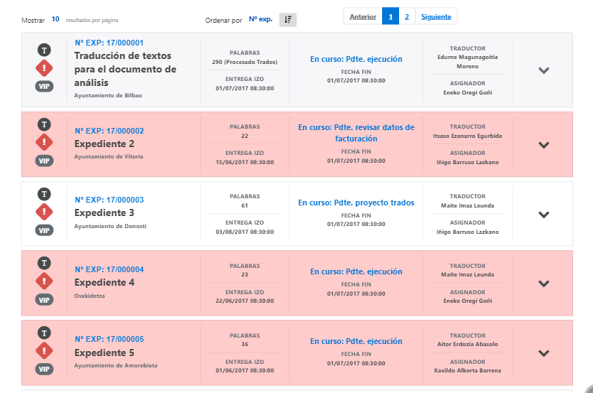

#	Componentes RUP – Hora

<!-- MDTOC maxdepth:6 firsth1:1 numbering:0 flatten:0 bullets:1 updateOnSave:1 -->

   - [1   Introducción](#1-introducción)   
   - [2   Ejemplo](#2-ejemplo)   
   - [3   Casos de uso](#3-casos-de-uso)   
   - [4   Infraestructura](#4-infraestructura)   
      - [4.1 Dependencias](#4.1-dependencias)   
      - [4.2 Versión minimizada](#4.2-versión-minimizada)   
   - [5   Invocación](#5-invocación)   
   - [6   API](#6-api)   
   - [7   Interacción con teclado](#7-interacción-con-teclado)   
   - [8   Sobreescritura del theme](#8-sobreescritura-del-theme)   
   - [9   Integración con UDA](#9-integración-con-uda)   

<!-- /MDTOC -->


##	1	Introducción
Normalmente, desde el punto de vista de un diseñador, las pantallas de búsqueda y resultados se plantean como un formulario de búsqueda y una tabla como presentación de los registros encontrados en el sistema.

Sin embargo, esta forma de entender las pantallas actualmente está obsoleta. Aunque en ciertas ocasiones puede ser la forma más correcta de visualización, normalmente se encuentra en desuso en la mayoría de aplicaciones web modernas.

Desde UDA se propone el componente de listados, llamados a sustituir la visualización de los registros de búsqueda en en aquellas pantallas donde los requisitos de información a presentar no deben quedar condicionados ni por la resolución de los dispositivos en las que se presenta ni por la cantidad de la misma.

Además de ser una solución que actualmente estamos acostumbrados a ver en cualquier página web o aplicación nativa, estos listados nos permiten tener una mayor personalización de cómo se muestra la información en pantalla.

##	2	Ejemplo
Se muestra a continuación unos ejemplos en los que es más aconsejable el uso de un listado que el de una tabla:

- [ Ej1 ] Cuando la cantidad de información que se quiere presentar es demasiado grande como para repartirla en múltiples columnas.

	En este caso un listado nos permite aprovechar tanto el ancho como el alto de la pantalla para mostrar todos los datos y si se desea plantear elementos expandibles.



- [ Ej2 ] Cuando se desea presentar los resultados de una forma alternativa.

	En este ejemplo se desea presentar los resultados como una lista de tarjetas de imágenes que ocupen el ancho de pantalla de forma dinámica en cantidad y tamaño.


##	3	Casos de uso
Podemos considerar correcto el uso de tablas para la presentación de resultados cuando los datos a mostrar por cada registro son pocos y de un tamaño conocido que se sabe no ocuparan en conjunto más de una sola línea de caracteres en pantalla.

Además su uso está orientado a visualización en dispositivos con un ancho de pantalla conocido, dado que la forma de adaptación de las tablas a RWD es muy mala, tanto que la forma más habitual de adecuación de las mismas a estos diseños suelen pasar por la ocultación de columnas en resoluciones bajas.

##	4	Infraestructura
Únicamente se requiere la inclusión de RUP en el proyecto en que se hará uso.

###	4.1	Dependencias
Todas las dependencias del componente se encuentran satisfechas dentro del propio empaquetado de RUP en su distribución actual.

###	4.2	Versión minimizada
La versión minimizada del componente se encuentra empaquetada dentro de los distribuibles minimizados de RUP (archivos \*.min.\*).

##	5	Invocación
Este componente se invocará mediante un selector que indicará todos los elementos sobre los que se va a aplicar el patrón Listado. Por ejemplo:
```javascript
$('#id_div_listado').rup_list(properties);
```
Donde el parámetro *“properties”* es un objeto *(var properties = {};)* o bien directamente su declaración. Sus posibles valores se detallan en el siguiente apartado.

##	6	API

Para ver en detalle la API del componente vaya al siguiente [documento](../api/rup.list.md).

##	7	Interacción con teclado
[...]

##	8	Sobreescritura del theme
[...]


##	9	Integración con UDA
[...]
